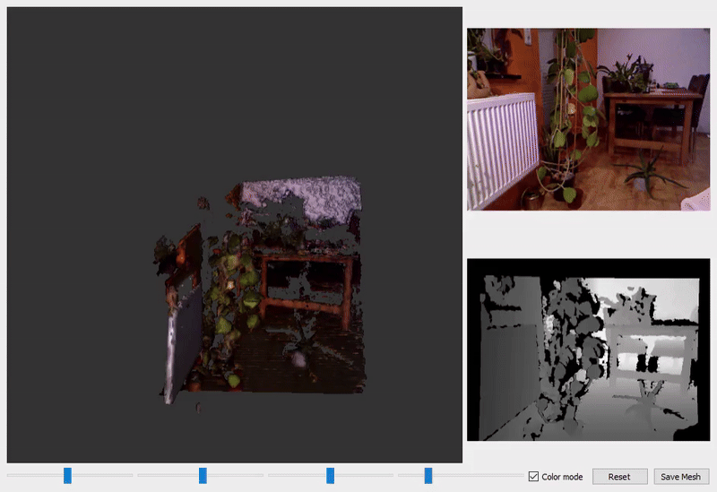
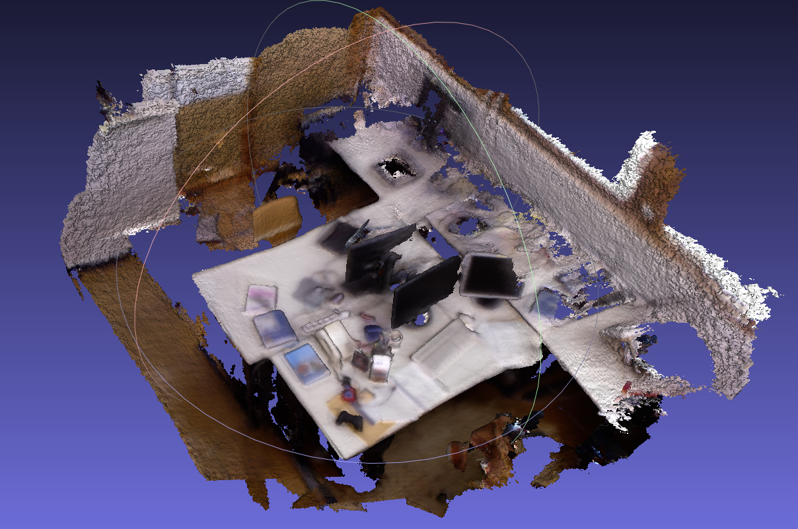

# KinectFusion

This repository contains an re-implementation of KinectFusion using Pytorch


<p align="center">
  <br/><br/>
   <sub><strong>Live KinectFusion Demo</strong></sub><br/><br/>
</p>

<div align="center">
  <div style="display: inline-block; text-align: center; margin: 0 10px;">
    <br/>
  </div>
  <div style="display: inline-block; text-align: center; margin: 0 10px;">
    <br/>
  </div>
  <div style="width: 100%; text-align: center; margin-top: 5px;">
    <sub><strong>Offline reconstructed mesh from frieburg desk dataset</strong></sub>
  </div>
</div>


## Installation

### Prerequisites
- **CUDA > 11.3** installed on your system.
- **Conda** installed ([Miniconda](https://docs.conda.io/en/latest/miniconda.html) or [Anaconda](https://www.anaconda.com/products/distribution)).
- **Kinect Sensor** (Required for live depth data processing).
- **Kinect SDK / OpenNI2** (Ensure drivers are installed to communicate with the Kinect).

### Setting Up the Environment

1. **Create a Conda environment**
   ```bash
   conda env create -f requirements.yml
   ```
   This will install all necessary dependencies.

2. **Activate the environment**
   ```bash
   conda activate kinectfusion
   ```

3. **Verify CUDA installation**
   ```bash
   nvcc --version
   ```
   Ensure the output shows a CUDA version greater than **11.3**.

4. **Ensure Kinect Sensor is connected and recognized**  
   Depending on your Kinect model, install the required drivers:
   - **For Kinect v1**: Install [OpenNI2](https://structure.io/openni) and ensure `libfreenect` is installed.
   - **For Kinect v2**: Install [Kinect SDK 2.0](https://www.microsoft.com/en-us/download/details.aspx?id=44561).
   - **For Kinect Azure**: Install [Azure Kinect SDK](https://github.com/microsoft/Azure-Kinect-Sensor-SDK).


5. Ensure that **Qt5** is installed:

    ```bash
    pip install PyQt5
    ```

    or use Conda:

    ```bash
    conda install -c conda-forge pyqt
    ```


## Updating OpenNI2 Path (Line 69 in Code)

If you're using OpenNI2, you **must update the `dist` path in the script** to match your system's installation path.

### **Locate OpenNI2 Redist Path**
Run the following command to find the correct **Redist** path:
```bash
find / -name "Redist" 2>/dev/null
```
This should return a path similar to:

```
/usr/lib/OpenNI2/Redist/
```

### **Modify the Code**
Go to **line 69** in your script and update it:

```python
dist = "/usr/lib/OpenNI2/Redist/"
```

If OpenNI2 is installed elsewhere, replace `/usr/lib/OpenNI2/Redist/` with your actual path.

---

## Running the Project

### **Run with GUI**
To start KinectFusion with the graphical user interface, run:
```bash
python main.py
```

### **Run without GUI (Live Processing)**
If you want to run the pipeline without a GUI (e.g., for real-time Kinect streaming), use:
```bash
python pipeline_live.py
```

### **Run on a Dataset**
To run KinectFusion on a dataset:
1. Open the `run_dataset.py` script.
2. Set the correct dataset paths inside the script.
3. Run the dataset processing pipeline:
   ```bash
   python run_dataset.py
   ```

---